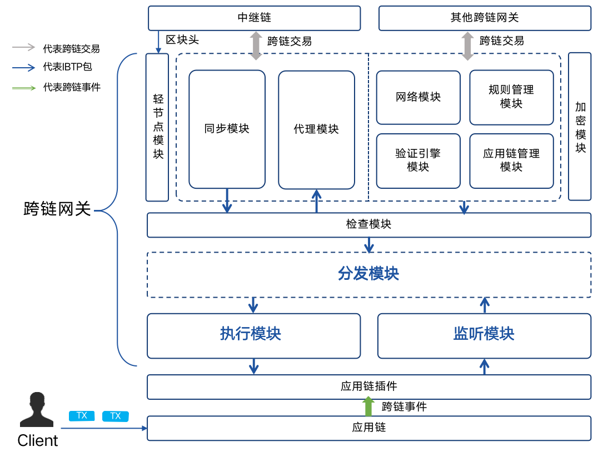
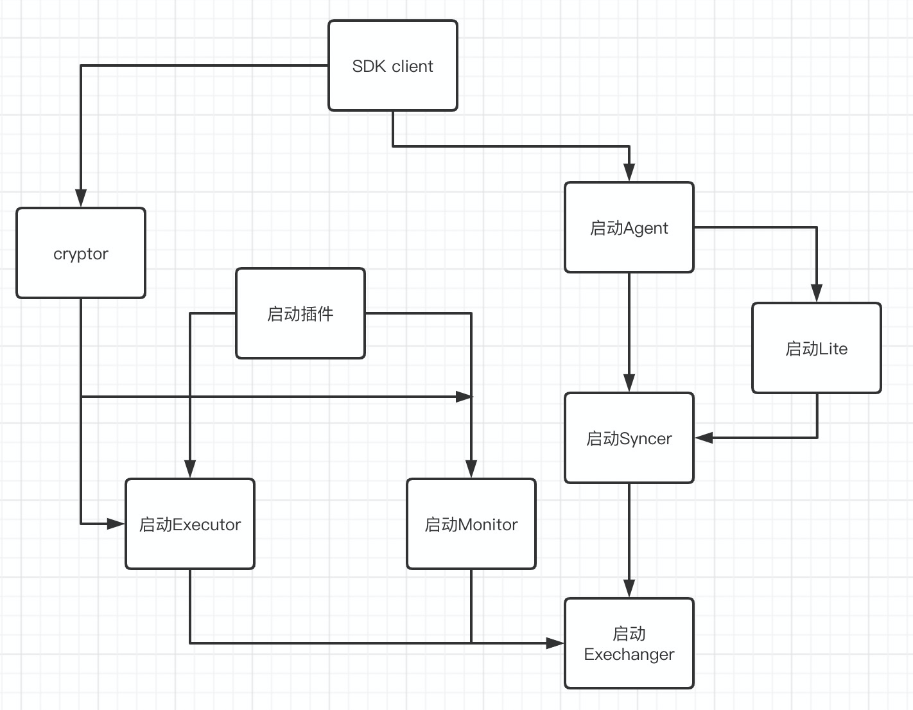
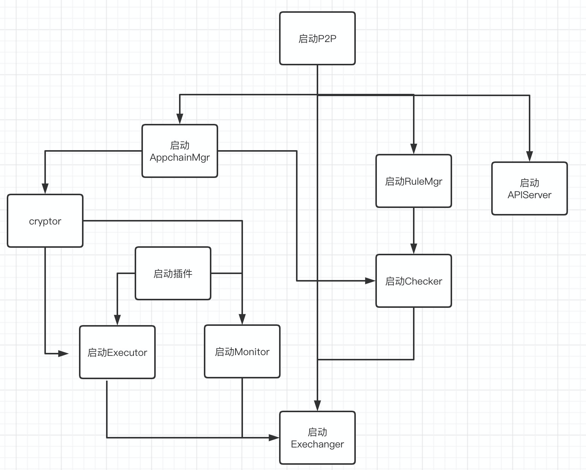
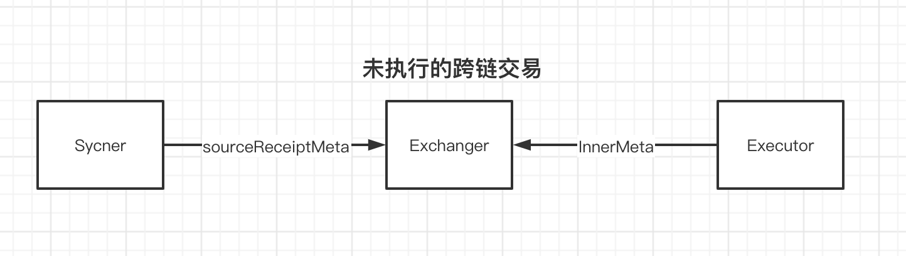
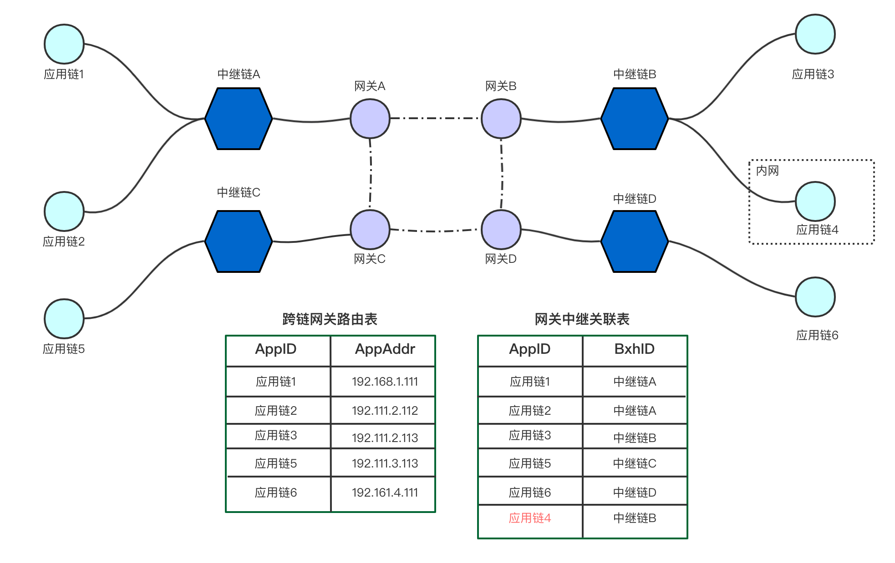
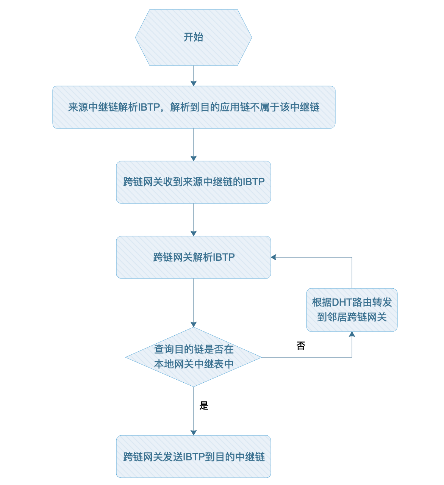
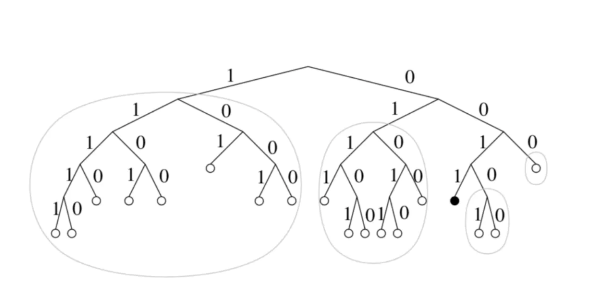

# 跨链网关设计方案
## 整体架构

在中继链的设计中，对于跨链网关的主要功能作了简要的介绍。本文主要详细介绍跨链网关的主要设计架构思想。

从跨链网关的**功能**上来说，设计上需要解决的难点包括以下几点：

1. **跨链网关需要对接不同架构的区块链，如何简化跨链网关接入不同区块链的跨链网关设计上需要考虑的问题。**

1. **跨链网关需要支持中继模式（直接和中继链连接）和直连模式（直接和其他的跨链网关进行连接），如何在不同模式间切换时设计上需要考虑的问题。**

**从总体架构来说，跨链网关根据不同的功能采取了模块划分的方式，主要的功能模块有Monitor，Executor，Exchanger**，Validate Engine，Appchain Manager，Network等。



## 处理流程

一次完整的跨链交易的处理过程如下：

A．Monitor监听

跨链网关PA启动之后，Appchain A发起一笔跨链交易，Monitor模块监听到该跨链交易，跨链网关对于该跨链交易做出检查之后，保存相应的跨链交易。

B．Exchanger转发

Exchanger获取Monitor收到的跨链交易，作相应的检查后，进行转发。转发过程中，根据跨链交易的目的链ID以及连接的是中继链还是直连的其他跨链网关等信息，转发到正确的路由路径。

1. 中继链模式

通过中继链的SDK，提交跨链交易到中继链的内置合约上，中继链记录并执行验证，转发等操作。

2. 直连模式

通过P2P网络连接其他跨链网关，通过跨链交易的目的链ID来转发到相应的跨链网关。

C. Exchanger接受外部跨链交易

1. 中继链模式

Exchanger 的子模块Lite和Syncer负责同步中继链的区块头和跨链交易的信息，对于验证通过的跨链交易，Exchanger进行转送到Executor中。

2. 直连模式

Exchanger通过P2P网络收到对方跨链网关发送的跨链交易，并作出相应的验证操作。验证通过的跨链交易转送到Executor中。

Executor提交跨链交易到应用链上，并根据执行的结果，构造返回的回执类型的IBTP包，转送到Exchanger进行下一步的转发工作。

C．跨链交易在目的链执行之后，返回回执信息。

1. 中继链模式

Exchanger 的子模块Lite和Syncer负责同步中继链的区块头和跨链交易的信息，对于验证通过的跨链交易和回执信息，Exchanger进行转送到Executor中。

2. 直连模式

Exchanger通过P2P网络收到对方跨链网关发送的跨链交易，并作出相应的验证操作。验证通过的跨链交易或者回执转送到Executor中。

以上，就是一次完整的跨链交易的执行过程。

## 模块依赖关系

### 在中继链模式下



### 在直连模式下



## 错误场景处理

在我们的设计中，极端情况下，跨链网关可以在没有保存任何跨链相关的数据就能正确启动。当然这需要不断的恢复之前的数据，重启的网络通信代价比较大。为了减少网络传输的启动负担，我们在对于一些关键的跨链信息还是进行了数据库的保存操作。

### Executor 开源版本错误分析

**中继链清除数据**

中继链清除数据之后：

   1. 如果A链的跨链网关不重启，再从其他链（如B链）发来交易B-1。Exchanger 模块必定是忽略这些交易的。这种情况下只需多发几条交易覆盖前面序号的跨链交易即可。

**但是如果从该跨链网关发送新的跨链交易到中继链，中继链会有序号不对的报错。但是跨链网关对这部分还没有相应的错误处理机制。**

   2. 如果A链的跨链网关重启

执行模块对比两边的最新序号，无法进行有效操作。因为已经有跨链交易写入应用链的账本了，再次执行的话可能会有潜在的风险（比如转账的操作）

**合约清除数据**

合约清除数据之后

1. 如果跨链网关不重启，执行模块内存中还是正确的序号。

接受其他链的交易，执行模块会认为正常——但是提交到合约上时会有序号错误的出错情况，从而执行模块构造跨链交易失败的回执（来源链上可能会采取回滚操作）。后续的执行全部都会是这种失败的情况。

2. 如果跨链网关重启

执行模块查询的最新序号为 0 ，“其他方”可能为5。该种情况会重新上链执行，但是发回的回执信息会**因为序号错乱被“其他方”拒绝**。（潜在风险是重新执行的结果和之前的不一致）但是覆盖完之前的序号之后，能够正常跨链。


### Monitor 模块错误场景分析

**中继链清除数据**

中继链清除数据之后，分两种情况分析

1. 如果跨链网关不重启，插件出现新的交易的话，Monitor 正常抛给其他模块，发送到中继链，会因为 IBTP的 Index 被拒绝执行。
按照现在的情况，会不断重试
   

2. 如果跨链网关重启，中继链记录的 Index 值清零。Monitor 按照应用链记录的交易全部重发。如果目的链的记录没有清空的话，之前处理过的会被应用链拒绝，后续可以正常工作；如果目的链记录清空的话，会造成交易重复执行（看场景能不能接受重复执行）

**合约清除数据**

合约清空

1. Pier 不重启，新的交易过来的话，会被Monitor 模块拒绝（可能需要多发几笔无用交易覆盖），之后能够重新工作。

2. Pier 重启的话，Monitor 查询的交易为空，中继链却有记录，Monitor 没有有效的处理手段，必须有外部来推送新交易。


## Exchanger 模块设计

在新的设计中，统一由Exchanger模块维护 Index 相关的信息，需要满足以下的几个功能点。

1. 接受来自 Monitor模块的交易并校验index，校验成功后交与 Syncer 模块提交给中继链执行IBTP；

2. 接受来自 Syncer 模块的交易并校验 index，校验成功交与Excuter模块提交给应用链执行IBTP； 然后处理IBTP回执。

3. 对于丢失的IBTP交易，要求 Syncer 和 Monitor 提供按照 IBTP_ID  的查询方式；

4. 对于丢失的IBTP回执，要求 Executor 提供按照 IBTP_ID  的查询方式；


错误处理

由于Exchanger作为中继链和应用链的模块中的转发模块，对Index的校验的要求非常高，要求一定要根据From按序进行。

**中继链 -> 跨链网关**

如果Exchanger模块收到了Sycner来的跨链交易，执行以下操作：

比较收到的IBTP的序号 Index1 和内存中维护的序号信息 Index2 ：

1. Index1 = Index2 + 1，是正常处理的逻辑

2. Index1 < Index2 + 1

说明Agent重复提交了该IBTP，直接抛弃该IBTP即可。

1. Index1 > Index2 + 1

说明Sycner漏掉了某些IBTP没有发送，按照漏掉的 IBTP 的 IBTP_ID ，调用Agent的查询接口恢复漏掉的 IBTP 即可。


**跨链网关 -> 中继链**

如果Exchanger模块收到了从Monitor来的跨链交易，执行以下操作：

比较收到的IBTP的序号 Index1 和内存中维护的序号信息 Index2 ：

1. Index1 = Index2 + 1，是正常处理的逻辑

2. Index1 < Index2 + 1

说明Monitor重复提交了该IBTP，直接抛弃该IBTP即可。

1. Index1 > Index2 + 1

说明Monitor漏掉了某些IBTP没有发送，按照漏掉的 IBTP 的 IBTP_ID ，调用Monitor的查询接口恢复漏掉的 IBTP 即可。


如果在恢复IBTP的过程中出错，则交由相应模块一直retry（不考虑中继链和应用链删除数据的情况）。

### 架构图


### 恢复机制

#### 未提交的跨链交易


pier在宕机重启后，需要把应用链中未提交到中继链的跨链交易提交到中继链，那么需要进行以下步骤：

1. 从Monitor模块获取应用链当前的跨链交易信息，合约中使用outterMeta保存

2. 从Sync模块中获取已经提交到中继链的跨链交易信息，中继链中使用interchainMeta保存

3. 遍历outterMeta和interchainMeta对比还没提交到中继链的跨链交易，然后调用Monitor模块获取相应的跨链交易并提交到中继链

#### 未执行的跨链交易



在 pier 宕机重启之后，有三种类型的未执行交易：

- 从其他链发过来的跨链交易未执行

由于网关都是按照中继链高度顺序执行的，这部分不用特殊的恢复机制。重启之后 Syncer 从上次记录的高度重新执行。

- 已经执行的跨链交易，但是回执未发回去

通过 Executor 模块获取 InnerMeta，再从 Syncer 获取 SourceReceiptCounter

遍历 InnerMeta 和 SourceReceiptCounter 对比能够知道那些交易已经执行但是回执还没返回给中继链，并通过 Executor 模块去应用链获取IBTP 回执。

- 还未执行的Callback 交易（对应自己已经发出的带Callback的跨链交易）

由于跨链交易回执也是一种**跨链交易，中继链会打包在 InterchainWrapper中，跨链网关按照顺序来自然会执行到，不用额外的恢复机制。**

## Monitor 模块设计

Monitor不再维护index相关的信息，由Exchanger统一进行维护。需要满足一下的几个功能点：

1. 通过插件监听区块链上的跨链交易

2. 提供查询IBTP的接口（根据ibtp id）

3. 提供查询应用链上跨链交易Meta信息的接口

### 接口设计

```go
type Monitor interface {
	// Start starts the service of monitor
	Start() error

	// Stop stops the service of monitor
	Stop() error

	// listen on interchain ibtp from appchain
	ListenIBTP() <-chan *pb.IBTP

	// query historical ibtp by its id
	QueryIBTP(id string) (*pb.IBTP, error)

	// QueryOuterMeta queries latest index map of ibtps throwed on appchain
	QueryOuterMeta() map[string]uint64
}
```

### 错误处理

1. 应用链监听出问题

2. 查询IBTP可能出现以下错误：

    - 输入的IBTP ID格式有误

    - index不存在（只要合约不动，就不会出现这个情况）

    - 合约调用出错，比如合约地址不对，方法名出错等（重试，需要打log进行排查或者更换配置）

    - 调用时网络出错（需要重试）

3. 查询meta出错，需要retry


## 主备模块设计

在新的设计中，主备高可用将会成为一个单独的模块，并且在Pier的配置文件中移除主备节点编号的配置项，改为再主备节点启动时随机生成序号的方案。需要满足以下的几个功能点：

1. 能够在启动时自主发现自己是主节点还是备用节点

2. 备用节点能够在主节点宕机的情况下主动升级成为主节点，继续完成跨链请求

3. 主备节点之间不会互相干扰，不会出现跨链交易的重复执行

### 接口设计

```go
type HAMng interface {
	Start() error // 启动Pier的主从模式

	Stop()  error // 停止Pier的主从模式

	IsMain()  <-chan bool // 判断是主节点还是备用节点
}
```

### 错误处理

**同时有两个主节点：**

1. 如果主备两个节点同时连接中继链的一个节点，同时有两个主节点的错误不会产生；

2. 如果主备两个节点连接中继链的两个不同节点，有极低概率产生同时有两个主节点的错误。

**解决方案**：针对该问题，新的设计将会在中继链节点收到广播询问后查询本地的主节点列表通道，如果有通道请求将会返回已有主节点的回复，并且缓冲回复给Pier，让Pier的主备节点发起新一轮的竞争。


## Executor模块设计

在新的设计中，Executor 不再维护 Index 相关的信息，只是作为单纯的执行器。需要满足以下的几个功能点。

1. 接受来自 Exchanger 模块的交易，并提交到插件执行

2. 对于执行的结果，构造出新的IBTP，发回给 Exchanger 模块

3. 对于丢失的IBTP交易，提供按照 From + Index 的查询方式

4. 重启之后查询应用了上最新的已执行的 Meta 信息

### 接口设计

```go
type Executor interface {
	Start() error // 启动Executor模块

	Stop()  error // 停止Executor模块

	// 执行IBTP并返回结果，如果没有执行结果，返回 nil
	ExecuteIBTP(ibtp *pb.IBTP) (*pb.IBTP, error)

	// 查询最新的链上已执行的 Meta 信息
	QueryInterchainMeta() map[string]uint64
	
	// 查询最新的链上已收到回调的 Meta 信息
	QueryCallbackMeta() map[string]uint64

	// 查询历史跨链交易的执行结果的回执
	QueryIBTPReceipt(from string, index uint64, originalIBTP *pb.IBTP) (*pb.IBTP, error)
}
```

### 错误处理

执行模块相信执行传进来的IBTP是有序的，序号的维护由其他模块维护。现在该模块只需要提交交易上链即可。

#### 提交交易到应用链

因为跨链网关提交交易到应用链也可能会有很多情况出现，不同场景下的处理方式不一致。

    - 因为网络出错导致提交交易无法成功（其他类型需要重试的情况）

这种情况执行重试即可 **（但是必须确定是网络错误）**

    - 因为跨链交易参数设置出错
    
    - 函数或者函数参数出错，或者ABI文件配置出错

这种情况下调用合约的专门的出错函数，使得该 Index 被消耗。

    - 函数参数都正确，但是合约执行时目的合约不存在等错误

直接在合约记录该交易为失败，并返回，Index 被消耗。

    - 提交上链成功，但是构造回执失败（Core打印错误）

由于回执IBTP是由插件进行构造的，所以跨链网关需要预设插件一定会构造回执返回出来。（跨链网关**需要对插件返回的东西进行检查，防止不必要的Panic**）

## Syncer 模块设计

Syncer 模块负责和中继链的交互，Exchanger 有任何从中继链获取信息的需求都是通过 Syncer 模块进行。Syncer 需要提供的功能：

1. 监听中继链上的跨链交易，并推送跨链交易到 Exchanger 中

2. 根据应用链 ID 查询中继链上的Meta信息

3. 根据 IBTP ID 查询中继链上跨链交易

4. 发送跨链交易到中继链上

5. 向中继链查询资产交换类型跨链交易的多签信息


### 接口设计

结合现在 Exchanger 的设计，Syncer 需要提供以下的接口

```go
type Syncer interface {
	// 启动Syncer模块
	Start() error 
	
	// 停止Syncer模块
	Stop()  error 
	
	// 查询中继链上已收到的跨链交易的最新 Index 的Meta信息
	QueryInterchainMeta() map[string]uint64 

	// 根据 IBTP 的 ID 查询中继链上的记录
	QueryIBTP(ibtpID string) (*pb.IBTP, error)

	// 监听链上抛出的跨链交易
	ListenIBTP() <-chan *pb.IBTP
	
	// 发送其他链的 IBTP 到应用链上执行。
	SendIBTP(ibtp *pb.IBTP) error

	// 从中继链获取资产交换的多签信息
	GetAssetExchangeSigns(id string) ([]byte, error)
	
	// 从中继链集群获取IBTP的多签信息
	GetIBTPSigns(ibtp *pb.IBTP) ([]byte, error)

	// 从中继链获取已注册的应用链组
	GetAppchains() ([]*rpcx.Appchain, error)

	// 通过appchain id获取 interchain meta信息
	GetInterchainById(from string) *pb.Interchain

	// 注册Union模式下的recover处理器
	RegisterRecoverHandler(RecoverUnionHandler) error
	
	// 注册可拉取appchains信息的处理器
	RegisterAppchainHandler(handler AppchainHandler) error
}
```

### 恢复处理

Syncer 从中继链同步到的信息，可以暂时存放在本地的存储中。需要记录的信息是：

1. 上次执行到最后一个区块高度

2. 已经接收到的IBTP的信息

重启之后，有两种情况：

- 如果存储没有删除，查询到最后一个处理过的区块高度，从这个高度开始进行跨链交易的处理（可能会有部分跨链交易重复提交，但是没关系，Exchanger会忽略这些重复提交的交易）

- 如果存储被删除，Syncer 重第一个区块开始同步，并提交这些区块的所有交易（这里也会由 Exchanger 模块来忽略已经执行过的交易）


## 插件设计

### 概述

由于现在采用区块链服务的各种应用可能在使用多种不同架构的区块链，所以如果跨链平台想要获得对接各种区块链的跨链能力的话，必然使得适配异构区块链的部分过于复杂。

为了简化跨链网关对于不同架构的区块链的适配工作，我们将所有直接和应用链直接交互的部分抽象到Plugin中，Plugin为跨链网关提供必要的查询应用链状态、提交跨链交易到应用链等服务的接口，做到了对于应用链本身架构复杂性对于跨链网关是透明的。

Plugin模式的一大特点是将Pier与应用链的交互模块和Pier核心模块进行解耦，从而方便更多的应用链加入跨链系统中。Plugin作为一个和Pier相对独立的一个模块，是通过Pier运行时外部启动服务的方式进行使用。为了能实现与应用链的交互能力，Plugin需要根据不同区块链的机制具体实现特定的接口。接口需要满足以下几个功能：

- 监听相应区块链上的跨链事件并传递给Pier处理；

- 执行来自于其他区块链的跨链请求；

- 能够查询相应区块链上跨链交易相关的元数据。

- 能够查询执行跨链交易和跨链请求的历史数据

总的来说，采用Plugin机制的优势有如下两点：

- 方便更新，能够在不停止Pier的方式下更新Plugin；

- 方便适配不同的区块链，而不用改动Pier。

### Plugin接口设计

为了减少Pier core和应用链之间的耦合，我们设计了Plugin的统一的接口，Plugin主要为Pier core提供向应用链的状态查询和资源调用的接口。具体的接口和说明如下：

```go
type Client interface {
	// 传递相应的信息进行初始化
	Initialize(configPath string, pierID string, extra []byte) error

   // 启动Plugin服务的接口
   Start() error
​
   // 停止Plugin服务的接口
   Stop() error
​
   // Plugin负责将区块链上产生的跨链事件转化为标准的IBTP格式，Pier通过GetIBTP接口获取跨链请求再进行处理
   GetIBTP() chan *pb.IBTP
​
   // Plugin 负责执行其他链过来的跨链请求，Pier调用SubmitIBTP提交收到的跨链请求。[][]byte 为执行跨链请求的结果。
   SubmitIBTP(*pb.IBTP) (*pb.SubmitIBTPResponse, error)
   
   // GetOutMessage 负责在跨链合约中查询历史跨链请求。查询键值中to指定目的链，idx指定序号，查询结果为以Plugin负责的区块链作为来源链的跨链请求。
   GetOutMessage(to string, idx uint64) (*pb.IBTP, error)
​
   // GetInMessage 负责在跨链合约中查询历史跨链请求。查询键值中from指定来源链，idx指定序号，查询结果为以Plugin负责的区块链作为目的链的跨链请求。
   GetInMessage(from string, idx uint64) ([][]byte, error)
​
   // GetInMeta 是获取跨链请求相关的Meta信息的接口。以Plugin负责的区块链为目的链的一系列跨链请求的序号信息。如果Plugin负责A链，则可能有多条链和A进行跨链，如B->A:3; C->A:5。返回的map中，key值为来源链ID，value对应该来源链已发送的最新的跨链请求的序号，如{B:3, C:5}。
   GetInMeta() (map[string]uint64, error)
​
   // GetOutMeta 是获取跨链请求相关的Meta信息的接口。以Plugin负责的区块链为来源链的一系列跨链请求的序号信息。如果Plugin负责A链，则A可能和多条链进行跨链，如A->B:3; A->C:5。返回的map中，key值为目的链ID，value对应已发送到该目的链的最新跨链请求的序号，如{B:3, C:5}。
   GetOutMeta() (map[string]uint64, error)
​
   // GetCallbackMeta 是获取跨链请求相关的Meta信息的接口。以Plugin负责的区块链为来源链的一系列跨链请求的序号信息。如果Plugin负责A链，则A可能和多条链进行跨链，如A->B:3; A->C:5；同时由于跨链请求中支持回调操作，即A->B->A为一次完整的跨链操作，我们需要记录回调请求的序号信息，如A->B->:2; A->C—>A:4。返回的map中，key值为目的链ID，value对应到该目的链最新的带回调跨链请求的序号，如{B:2, C:4}。（注意 CallbackMeta序号可能和outMeta是不一致的，这是由于由A发出的跨链请求部分是没有回调的）
   GetCallbackMeta() (map[string]uint64, error)
​
   // CommitCallback 执行完IBTP包之后进行一些回调操作。
   CommitCallback(ibtp *pb.IBTP) error
​
   // Name 描述Plugin负责的区块链的自定义名称，一般和业务相关，如司法链等。
   Name() string
​
   // Type 描述Plugin负责的区块链类型，比如Fabric
   Type() string
}
```

### 设计说明

由于不同类型的区块链在架构上的不同，具体实现上述的接口必然有所不同，我们没发从代码层面仔细介绍，但是能够大概介绍一下Plugin的实现的思路。

在我们的设计中，跨链网关和Plugin之间涉及到跨链交易的接口都是通过IBTP来交互的，跨链网关不需要关心在应用链上跨链请求不同的数据格式，需要处理的都是IBTP Package。所以在实现Plugin上也需要围绕IBTP Package作出一定的适配。总的来说具体需要做到如下的几点：

1. 监听应用区块链上的跨链事件，并传递给Pier core进行处理。这个一般可以通过订阅区块链的事件的功能来做到。需要注意的是，Plugin需要负责跨链事件到IBTP Package的转换。Plugin重要的特点之一就是屏蔽了底层应用链不同数据格式之间的复杂性，向Pier core提供了统一的IBTP Package的数据结构，这对于Pier core的处理来说更加便捷。

2. 提供查询应用链跨链合约维护的跨链Meta信息接口。Pier本身是不保存跨链交易的状态信息的，需要长时间存储的跨链交易记录信息都应该在中继链和应用链上进行记录。所以Pier无论什么时候都应该可以从宕机等情况中恢复，恢复的过程也正需要这些接口进行查询。

3. 提交其他链上来的跨链请求。这一步是监听本应用链跨链请求的逆操作，但是Plugin和Pier core在交互上都应该是IBTP格式的Package，所以这部分功能中，Plugin需要解开IBTP package，转化为应用链可以识别的数据结构，在提交到跨链合约上进行执行。同时对于跨链交易可能的执行出错，Plugin也应该提供一定的错误处理能力。对于执行的结果，也需要为Pier core 提供统一的Response数据结构。

## 跨链合约设计

按照IBTP结构的设计的话，BitxHub只负责记录应用链这个粒度的跨链交易的Index。但是在Pier调用应用链智能合约执行跨链交易时，有多个智能合约的情况下，很难维护一个应用链层面的Index。

所以我们考虑在各个应用链上维护两个不同的合约。一个合约负责对接跨链网关Pier，为跨链管理合约Broker；一个合约负责具体的业务场景，为业务合约。业务合约需要跨链时，要统一将跨链请求提交到Broker合约上，Broker统一和Pier进行交互。一个Broker合约可以负责对接多个业务合约。

### Broker合约

Broker有三部分主要的内容需要维护：交易序号、历史交易、错误处理

#### **交易序号**

该合约有三个跨链交易的序号需要维护：

```javascript
// key值为目的链地址to,value为发往该链的最后index
mapping(address => uint64) outerMeta;

// key值为来源链地址from,value为从该链发过来的最后index
map(address => uint64) innerMeta;

// key值为目的链地址to,value为该链已经执行回调的最后index
map(address => uint64) callbackrMeta;
```

上述的三个序号主要能够防止重放攻击和保证跨链网关提交交易的幂等性（某些场景下跨链网关能够放心的多次提交而不用担心重复上链）。

#### **历史交易**

历史数据又可以分为两个部分，一个是自身链上发起的跨链请求（发送到其他链上去）；一个是从其他链收到的跨链交易，执行完成后的记录。

```javascript
// 目的链地址 + 交易序号作为序号，自身链上发起的跨链请求内容作为 value
mapping(address + uint64 => record) outMessages;

// 来源链地址 + 交易序号作为序号，其他链发起的跨链交易执行结果作为 value
mapping(address + uint64 => result)) inMessages;
```

通过在 Broker 合约上记录历史数据，可以让跨链网关在重启、交易丢失等情况下恢复。以上只是伪代码的描述，具体在不同区块链的智能合约上实现时会有不同的策略。

### **错误处理**

由于Broker 上执行跨链交易要求交易序号严格递增。这导致在某些跨链交易因为参数错误等原因无法调用到跨链交易处理函数，序号无法消耗，从而后面所有的交易都被认为是无效的情况。

为了应对这种情况，我们在Broker 合约专门提供了错误处理函数。当某个跨链交易无法处理的时候，通过调用该函数可以消耗该跨链交易的序号，让后面的跨链交易能够正常进行。

```javascript
// 用来消耗执行其他链发起的跨链交易出错时的序号
function interchainError(address sourceChainID, uint64 index) public returns(bool);

// 用来消耗执行其他链返回的回调交易出错时的序号
function interchainConfirmError(address sourceChainID, uint64 index) public returns(bool);
```

## 大规模跨链

###  概述

现有的跨链网络分为**中继链+跨链网关**模式和**跨链网关直连**模式，如果要组成大规模混合跨链网络的万链互连系统，就需要跨链网关添加**分布式哈希表DHT**和**跨链交易路由**的功能。


**跨链交易路由流程：**

1. 中继链A中应用链A‘抛出跨链事件，目的链是中继链B中的应用链B’。

2. 应用链A‘的跨链网关收到跨链事件，发送IBTP给中继链A，中继链A验证跨链交易的有效性，验证成功后将该笔交易打包出块。

3. 跨链网关A解析中继链A的区块，解析到IBTP的目的链不属于中继链A管理的应用链，随后跨链网关A根据DHT路由到目的中继链B的跨链网关B。

4. 跨链网关B收到IBTP，将跨链交易发送到相应的中继链。

5. 中继链B验证跨链交易的有效性，验证成功后将该笔交易打包出块。

6. 应用链B‘的跨链网关同步中继链B的区块，收到中继链B‘路由的跨链交易，发送给应用链B’执行跨链交易。


### 详细设计

在大规模跨链网络中，网络拓扑图如下：



####  路由传输

每个跨链网关维护两个表，一个为**跨链网关路由表(PTable)**，记录应用链ID和应用链网络地址的关联关系，具体实现为DHT，如下表所示：

| AppID                                      | AppAddr                                                                         |
| ------------------------------------------ | ------------------------------------------------------------------------------- |
| 0xe6f8c9cf6e38bd506fae93b73ee5e80cc8f73667 | /ip4/111.132.1.111/quic/5001/p2p/QmZZFk1Tj6p25ecz98SpyHxb6joDPxR3wVPptDwuc8fue1 |
| 0x8374bb1e41d4a4bb4ac465e74caa37d242825efc | /ip4/171.132.1.131/quic/4002/p2p/QmNRgD6djYJERNpDpHqRn3mxjJ9SYiiGWzExNSy4sEmSNL |


另一个本地缓存的**网关中继关联表(PBTable)**，记录应用链ID和中继链的关系。如下表所示：

| AppID                                      | BxhID |
| ------------------------------------------ | ----- |
| 0xe6f8c9cf6e38bd506fae93b73ee5e80cc8f73667 | bxhA  |
| 0xe1sdddcf6e38bdxxxae93b73ecscs0cc8f73112  | bxhA  |


**种子节点：**由每个接入到路由网络的跨链网关维护，如上图种子节点可以是PierA和PierB**。**

**Pier新增：**

1. Pier连接到中继链，中继链路由模块发生Add Pier动作后，将所属中继链管理的所有应用链信息广播给所属的Pier，Pier构造本地的**网关中继关联表**；

2. Pier加入路由网络，连接种子节点，构造**跨链网关路由表**；

3. 路由网络中其它Pier收到了广播的信息，更新本地的**跨链网关路由表；**

4. 如果应用链方只是想加入该中继联盟的跨链网络，并不想加入整个大规模网络中，可以在应用链注册时添加字段用于判断是否支持大规模跨链。

**Pier更新：**

1. 类似Pier新增。

**Pier删除：**

1. Pier在加入路由网络后，长时间Ping_Pier无响应，**跨链网关路由表**会自动删除该Pier信息。

**IBTP传输流程图：**




**跨链网关路由模块接口定义：**

```go
type Router interface {
	// Start starts the router module
	Start() error

	// Stop
	Stop() error

	//Broadcast broadcasts the registered appchain ids to the union network
	Broadcast(ids []string) error

	//Route sends ibtp to the union pier in target relay chain
	Route(ibtp *pb.IBTP) error

	//ExistAppchain returns if appchain id exit in route map
	ExistAppchain(id string) bool

	//AddAppchains adds appchains to route map and broadcast them to union network
	AddAppchains(appchains []*rpcx.Appchain) error
}
```

####  DHT

分布式哈希表采用S/Kademlia，相较于Kademlia提高了安全性，能够抵御不同程度的日蚀攻击、女巫攻击。



libp2p提供了对应的DHT库：[__https://github.com/libp2p/go-libp2p-kad-dht__](https://github.com/libp2p/go-libp2p-kad-dht)

####  IBTP验证

目的中继链验证来自跨链网关的IBTP是否真正在来源中继链验证成功并且执行上链，提供以下两种证明方式：

**多重签名：**

来源中继链产生的跨链交易需要来源中继链节点的多重签名，最少签名阈值为Quorum数量，跨链网关路由传递IBTP的时候把对应多重签名信息带上。

**SPV证明：（需要同步全网中继链的区块头）**

目的中继链通过跨链网关同步来源中继链的区块头，验证IBTP的跨链交易是否存在于来源链的区块内，验证成功即表示IBTP是有效的。

