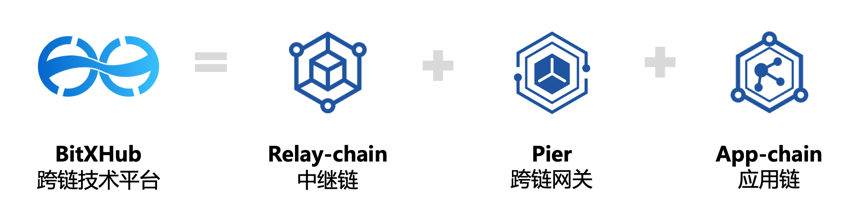
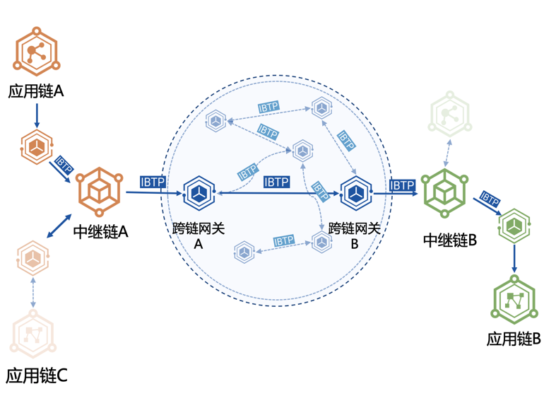
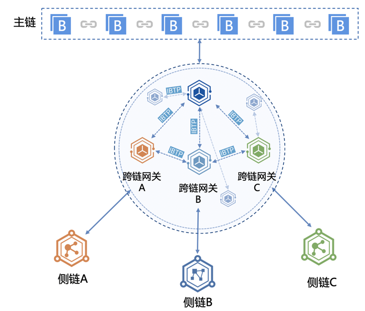
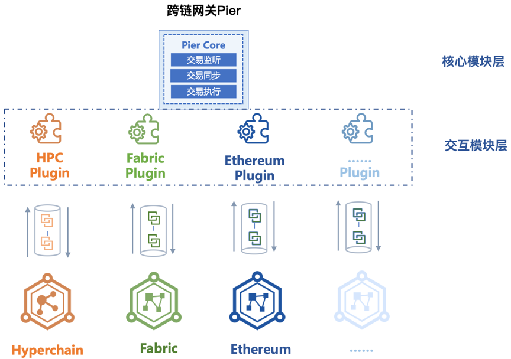
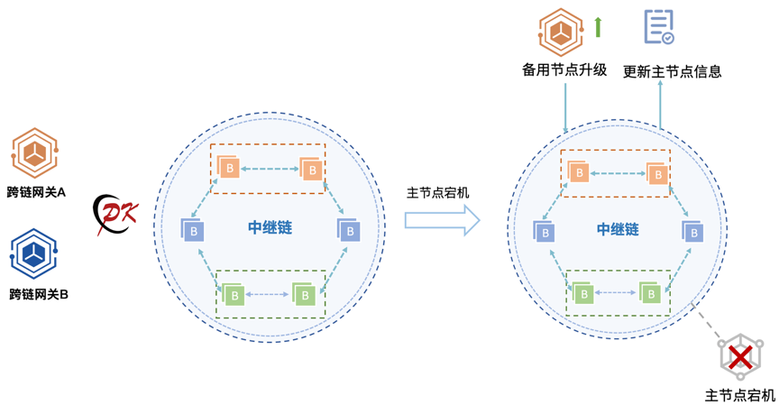
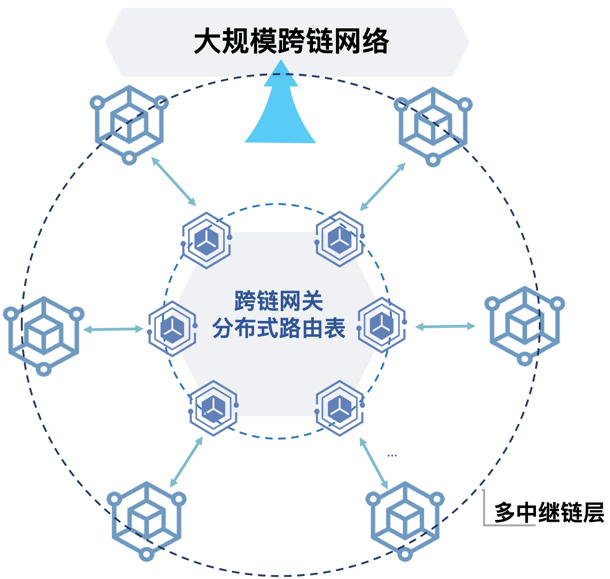

# 跨链服务平台介绍

## 产品简介

BitXHub 是趣链科技自主研发的跨链技术平台，提供基于异构联盟链间的账本互操作解决方案。BitXHub 攻克了异构跨链过程中的交易捕获、信息传输以及身份验证等核心难题，同时兼容同构及异构区块链链间的跨链交易，允许异构区块链间的资产互换、数据互通及业务互补，致力于打造高可扩展、强鲁棒性、易运维升级的联盟链跨链通用协议及示范平台，为区块链生态中的网络互联与链上数据互通提供可靠、高效、安全的底层技术支撑。

BitXHub 于 2020 年 3 月正式开源，希望在开源社区共建下，针对更加丰富的业务场景，形成更加广泛的共识，让跨链协议更加通用化、标准化、规范化。期待更多的区块链开发者与相关行业从业者参与到趣链跨链技术标准化和革新演进的进程中，一起继续丰富完善跨链标准，桥接更多类型的区块链平台。

## 产品架构

趣链科技跨链技术平台 BitXHub 由三部分组成：中继链、跨链网关、应用链。

**中继链（Relay-chain）**：用于应用链管理以及跨链交易的可信验证与可靠路由，是一种实现 IBTP 协议的开放许可链，确保跨链交易的事务一致性；

**跨链网关（Pier）**：由相应的应用链维护的服务程序，担任着区块链间收集和传播交易的角色，既可以支持应用链和中继链之间，也可以支持中继链与中继链之间的交互；

**应用链（App-chain）**：负责承载不同应用场景下的具体应用的业务合约逻辑；

为了适应不同的应用场景，BitXHub 的设计采用灵活可组合架构，主要有三种架构：适配应用规模较大的中继链架构，处理效率更高效便捷的链对链架构以及区分层级关系的主侧链架构。

### 中继链架构

中继链架构由中继链和跨链网关组成。对于简单跨链场景，如下图 1-1 中，应用链 A 和应用链 C 之间的跨链操作，中继链 A 负责跨链交易的验证和存证，跨链网关在中继链和应用链间负责跨链交易的监听、同步和执行。

但由于中继链接入应用链的数量有限，为了更好地满足大规模跨链场景，需要接入多个中继链进行跨链。中继链间跨链通过跨链网关组成的跨链交易路由网络进行路由。如图 1-1 所示，应用链 A 想发送跨链交易到应用链 B 时，首先需要把跨链交易提交到中继链 A 中，跨链网关 A 同步到该跨链交易后，发现目的链不在中继链 A 负责的应用链联盟里面，就把跨链交易同步到跨链交易路由网络中。跨链网关 B 从路由网络中同步到该跨链交易后，提交到中继链 B，最后，由跨链网关提交到应用链 B 完成整个跨链操作。

中继链架构适用于安全性、可追溯性比较高的场景，可构建大规模异构区块链跨链网络。

### 链对链架构

对于安全性要求不高的场景，可以不借助中继链进行跨链操作，如图 1-2 是由跨链网关组成的链对链架构。如应用链 A 和应用链 B 的跨链互操作直接通过中间的跨链路由网络进行跨链交易的同步和传输，跨链交易的真实性验证也由跨链网关完成。

### 主侧链架构

如果参与方存在上下级的治理关系，可以选用主侧链架构。如图 1-3 中，中继链充当主链，负责侧链成员管理、数据一致性保障、核心数据存证等，且中继链的不可篡改特性可以方便实现跨链交易的原子性保障，中继链通过高性能智能合约的方式将跨链安全性验证规则化，方便实现异构区块链之间跨链交易验证的方法注入、升级；侧链通过跨链网关接入主链，负责承载具体的业务服务，形成可横向扩展的侧链集群。采用跨链网关的方式对接具体的应用侧链可以减少对具体数据治理链的侵入性，特别是针对异构数据治理链，网关可以将跨链交易转换成中继可解析验证的格式，对跨链互联服务屏蔽具体区块链的数据差异性；网关和中继链分离的方案可以保证中继链的稳定性。

## 跨链协议

不同区块链由于其底层平台的加密算法、区块结构等不同，不同区块链之间的消息不能直接通信。为了能够支持异构区块链之间的跨链交易路由和可信验证，BitXHub 设计了通用的跨链传输协议 IBTP（InterBlockchain Transfer Protocol）,允许异构资产、数据及服务进行跨链调用。
该协议内容指定了相关跨链事件的来源链、目的链、跨链交易方法以及验证策略、签名等诸多信息，支持应用链与中继链、应用链与应用链间的交互操作，其结构如图 1-4 所示。应用链的跨链消息通过跨链网关转换成 IBTP 结构提交至中继链，中继链通过 IBTP 内容进行跨链交易的合法性验证及可靠路由。基于 IBTP 协议跨链网关可将不同应用链抛出的事件数据格式转换为统一结构。

| 参数         | 说明                                  |
| -------------- | ------------------------------------- |
| From       | 来源链ID            |
| To         | 目的链ID            |
| Version    | 协议版本号           |
| Index      | 跨链交易索引         |
| Payload    | 跨链调用内容编码      |
| Timestamp  | 跨链事件发生时间戳    |
| Proof      | 跨链交易证明         |
| Extra      | 自定义字段           |

IBTP 消息采用 P2P 的方式进行传输，消息的主体内容均采用对方的公钥进行加密确保消息内容传播的不被第三方窃取。同时调用内容经跨链网关间协商的对称密钥加密后再发送至中继链，保障传输调用的安全性与可靠性。

## 中继链

### 共识算法

中继链接入了强鲁棒拜占庭容错算法 RBFT，其失效数据恢复、动态节点增删等机制保证了中继链天然的高可用性。BitXHub 中的跨链交易在以事件形式抛出时通过序号递增的方式存储，在共识阶段对来自同一应用链的交易需要严格按照序号顺序进行排序，若接收到的交易序号异常时暂时将其放入缓存中等待，直到正确序号的交易到达后再继续进行排序、打包。

为了满足更多应用场景的需求，BitXHub 的中继链可以对节点进行动态增删，链上的节点对中继链共同维护并参与共识，为了避免部分节点因为某些故障导致节点状态大幅落后区块链网络，平台提供一种 Sync Protocol 的方式来更新异常节点状态，保障整个中继链系统的稳定运行。

### 验证引擎

中继链中验证引擎的设计采用了验证器的插拔式设计，即对于不同的跨链交易所采用不同的验证规则策略，验证引擎会根据规则地址来判断采用不同的验证器进行验证。现阶段的验证引擎支持 Go 内置验证器和 WASM 虚拟机验证器。

### 事务管理

中继链内置了事务管理合约，提供基于本地消息表的事务支持，实现了跨链事务的最终一致性。事务管理合约在处理跨链交易时，根据目的链数量的不同（一个或多个），采用不同的逻辑生成跨链事务 ID，并将事务 ID 对应的初始状态记录在事务管理合约。当目的链执行完跨链交易后，事务管理合约根据目的链交易的执行结果（成功或失败）更新对应事务的状态。事务管理合约提供了接口，可供各应用链查询某个事务 ID 对应的事务状态。若应用链发现事务执行失败，则需要负责业务上的回滚操作。

## 跨链网关

跨链网关（Pier）是由应用链维护、可与应用链和中继链直接交互的核心组件，作为发送方时需保证跨链交易接收有序性，作为接收方时需验证跨链交易可靠性。每个区块链网络的管理员需要指定并维护自己可信任的跨链网关节点，允许跨链网关节点授信访问和解析本区块链上的区块链跨链信息和相关状态信息。
在复杂的跨链场景下，应用链如何便捷地接入跨链系统以达到良好的扩展性，对于激发跨链系统生态的活力至关重要。跨链网关是一种连接不同区块链系统的交互组件，在 BitXHub 中充当着两个不同的角色：
连接应用链和中继链。在单中继链的层级中，Pier 作为一个中间部件来 简化区块链接入跨链系统的过程，增强接入跨链系统的便捷性。
连接不同的中继链。在多中继链形成的区块链网络中，Pier 通过 P2P 组 网的方式在多个层级中起到“路由器”的作用。
为了实现上述的便捷性和可扩展性，跨链网关在应用链的适配和核心功能的实现上作了灵活设计。

### 插件机制

BitXHub 提供跨链网关插件机制，其一大特点是将跨链网关中与应用链的交互模块和核心模块进行解耦，从而方便更多的应用链加入跨链系统。如下图 1-5 所示，在跨链网关运行时，通过动态加载插件的方式完成应用链的接入。

### 网关高可用

为了更好的保障跨链网络之间互通的稳定性，BitXHub 提供主备跨链网关功能，如图 1-6 所示，基于中继链，主备跨链网关和中继链上的节点建立连接，通过竞争机制，按照连接节点的先后决定主备网关次序，保障中继链上网关主节点的唯一性。并支持主备网关进行灵活切换，当主节点网关出现异常宕机时，系统可进行自动无缝切换，为中继链提供高可靠的跨链服务，实现更加稳定的数据互通互联。

## 区块链互联网络

在最新的 BitXHub 跨链平台中，中继链在原有功能的基础上增加了大规模跨链网络的功能，如图 1-7 所示，通过跨链网关形成一个 P2P 网络，对不同中继链的跨链消息进行消息路由，达到平行扩展中继链的效果。在中继链之间的跨链网络中，增加大规模网络中的消息路由机制，并通过多签认证的方式，实现不同中继链上的应用链间的身份验证。目前平台可支持超过 1000+的应用链的并发接入性能。

跨链技术作为连接各区块链的桥梁，实现了不同区块链之间的资产原子性交易、信息数据互通、业务服务互补等功能，打破不同区块链间的数据孤岛。跨链技术是构建区块链互联互通网络生态，实现区块链“价值互联网”的关键枢纽。
