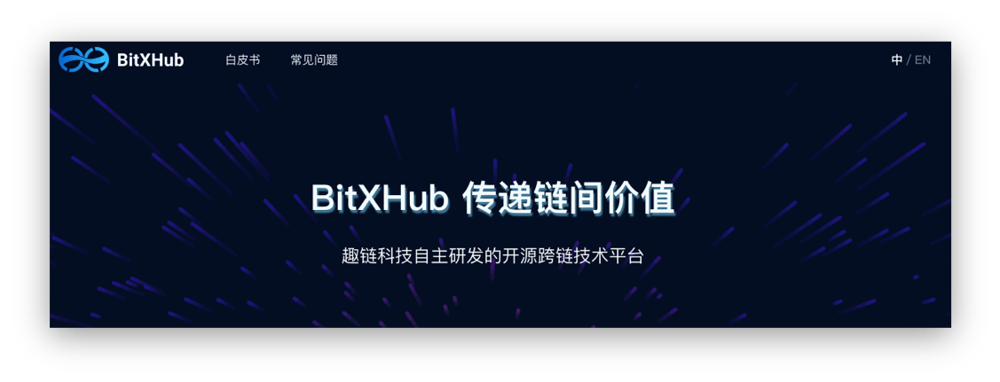

# 社区介绍

开源在区块链的发展历程中，发挥着至关重要的作用。开源的本质是共享技术，而技术是生产资料的组成部分，因此开源的社会意义实际上是实现了生产资料的共享。开源的商业意义则在于通过共享技术、推广技术标准从而打造了一个多方商业共同体。无论是对区块链行业，还是对趣链科技本身，开源都具有极为重要的意义，通过开源社区，我们希望：

1. 可以更好地打造共同繁荣的技术社区；

1. 各行各业都可以基于开源产品构建自己的生态，促进生态蓬勃发展；

1. 促进协议标准化，形成区块链行业的事实标准；

1. 开源社区是群体的自发进化，基于社区成长的技术具有更强的生命力。

趣链科技将区块链技术平台开源，希望**打造一个更加开放的架构，所有人都可以参与到跨链技术标准化和革新运动中**，一起继续丰富完善跨链标准，桥接更多类型各异的区块链平台，共同探索跨链的生态系统，真正实现区块链技术的商业闭环，从而推动中国开源运动更好、更快的发展。

- **BitXHub官网链接**

[__https://bitxhub.hyperchain.cn/__](https://bitxhub.hyperchain.cn/)

- **BitXhub开源社区地址**

[__https://github.com/meshplus/bitxhub__](https://github.com/meshplus/bitxhub)