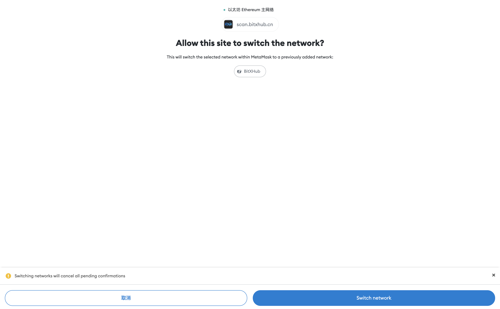
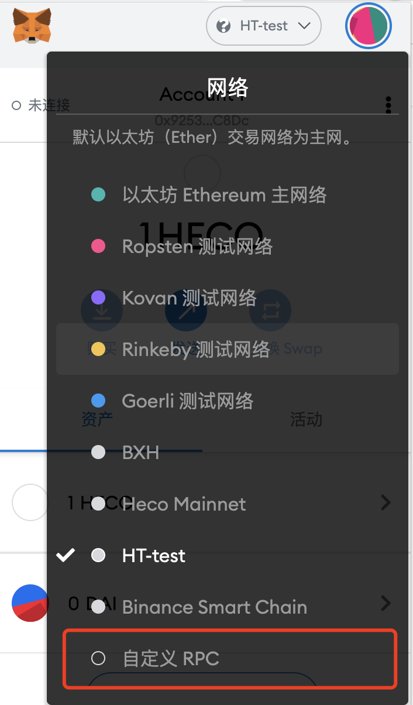
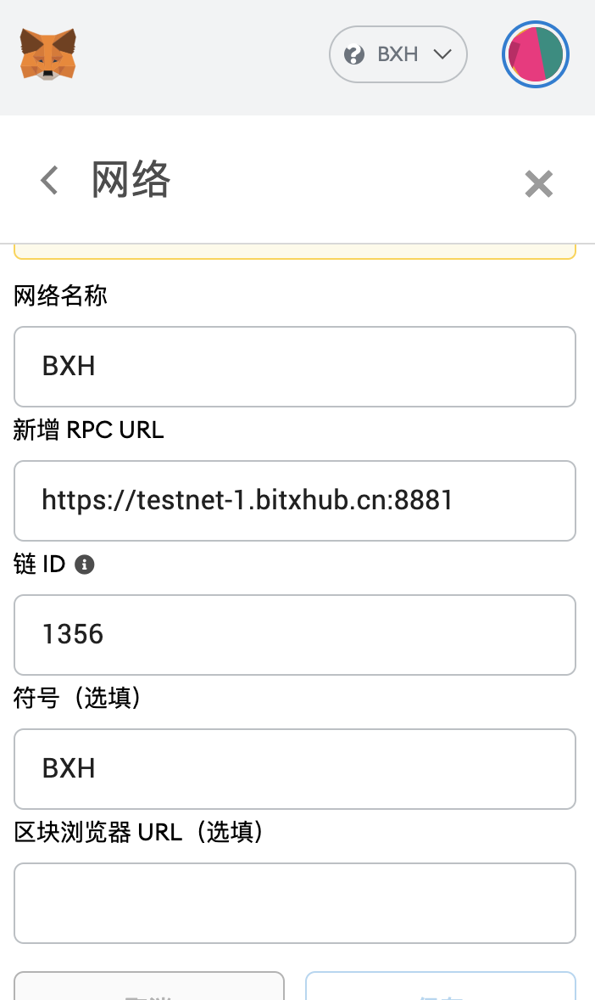
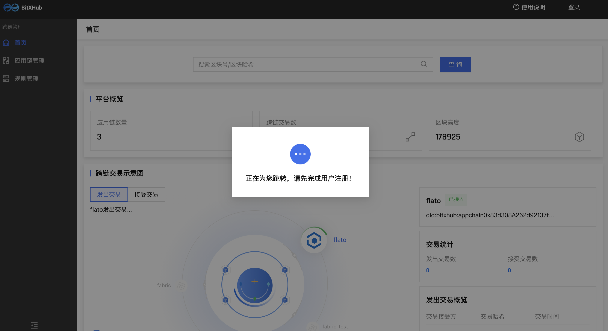
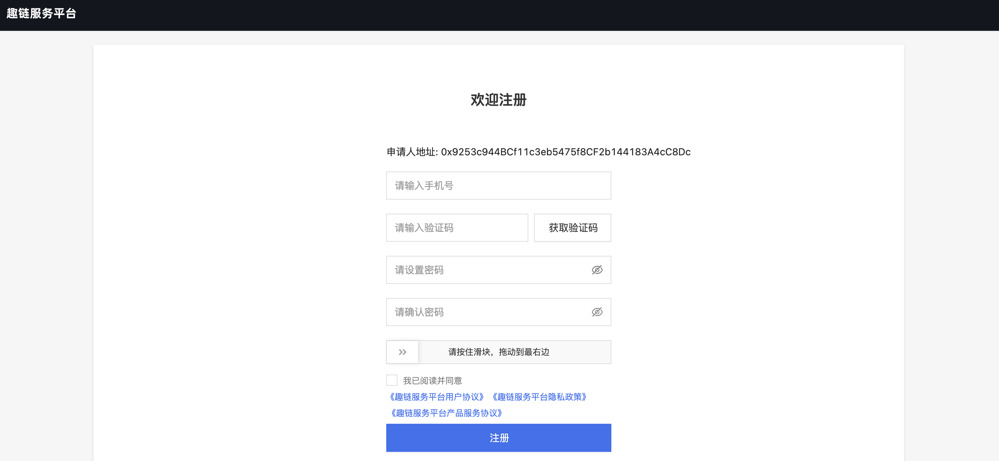
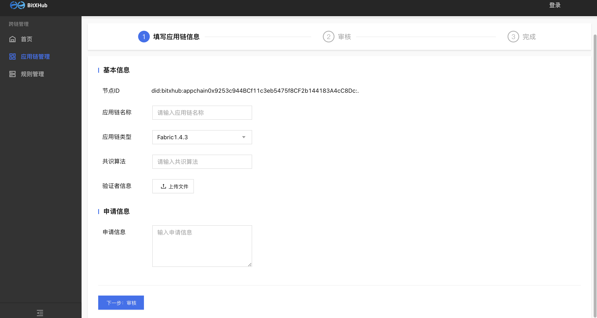

# 跨链浏览器体验指南

## 一、测试网配置流程

我们建议使用 Google Chrome 并安装 [MetaMask](https://github.com/MetaMask/metamask-extension/releases/download/v10.0.1/metamask-chrome-10.0.1.zip) 钱包扩展程序(推荐使用10.0.1及以上)。以下是 [MetaMask 常见问题解答](https://metamask.io/faqs.html) 供参考！

### 测试网自动配置

MetaMask插件安装完成后，点击浏览器【登陆】按钮，系统会弹出测试网自动配置添加页面，用户点击【Approve】，即可成功添加BitXHub测试网。


BitXHub测试网络添加成功后，系统会提示您进行网络切换，用户点击【Switch network】，即可成功切换至BitXHub测试网络并进行后续操作。



### 测试网RPC手动配置
选择顶部网络功能，然后选择【自定义RPC】进入网络配置页面。




### BitXHub测试网配置信息详情

**Chain ID**

```js
1356
```

**RPC URL**

```html
https://testnet-1.bitxhub.cn:8881
```

**配置如下图所示**



## 二、应用链环境准备

应用链接入中继链之前，需要进行相应的跨链合约部署以及跨链网关配置等操作。

### 部署跨链合约

可以参考BitXHub文档站[链接](https://meshplus.github.io/bitxhub/bitxhub/usage/single_bitxhub/deploy_pier/#_2)进行跨链合约部署。（注意：文档中提到的二进制或开源项目，均是要对应 v1.11.0的版本）

### 获取Pier部署包和修改配置

可以参考BitXHub文档站[链接](https://meshplus.github.io/bitxhub/bitxhub/usage/single_bitxhub/deploy_pier/#pier)。

**注意：**

1）文档中提到的二进制或开源项目，均是要对应 v1.11.0的版本；

2）以上pier配置过程，pier.toml中关于应用链的部分需要特别注意，以fabric为例，[appchain]字段下的配置示例如下，

```toml
[mode.relay]
addrs = ["testnet-1.bitxhub.cn:60111"]

[appchain]
plugin = "fabric-client-1.4"
config = "fabric"
```

### 获取应用链私钥（用于导入MetaMask钱包）

完成以上配置后，在页面上注册应用链之前，还需要将上一步pier配置目录下的key.json转换显示成可以导入MetaMask钱包的公私钥对，具体示例如下：

```bash
# 1.进入到pier的配置主目录，即pier.toml所在的目录
# 执行pier show命令
./pier show --path ~/.pier/key.json
# 返回结果示例：
private key: 0x88b434530176d3faf4dbf10ede1c25c4f7af673392152d71a18758a1ba677ddc
public key: 0x041b311209c6feb1587aaf16d7a1bac9f96c1fecb539d4cde416f97ff5048139beeac307d14d0e7196c7e15ad657530dedcc33bbe821276dadf3989bfff470747a
address: 0xE7f5E3c3963c6a588AB3de753817B3F735a6Ab58
# 将返回的private key的字符串导入到MetaMask钱包即可
```

## 三、浏览器可视化操作

### 用户实名绑定

BitXHub测试网络下，新用户首次点击【登陆】，需要完成手机实名绑定，系统会提示【正在为您跳转，请先完成用户注册】，并跳转到注册页面。



注册页面中，用户需要输入手机号进行验证码校验，完成密码设置后，点击【注册】，即可跳转返回跨链浏览器页面。新用户完成注册后，您的地址1h内将收到BitXHub测试网发送的燃料费用于跨链体验。



### 应用链注册申请

对于新注册的用户，您的地址1h内将收到BitXHub测试网发送的燃料费用于跨链体验。当您的地址中BitXHub测试网燃料费为0时，系统会提示【您的测试网燃料正分发中，请稍后】。


**应用链注册**



注册字段说明：

1. 节点ID：系统根据钱包地址自动生成

2. 应用链名称：自定义应用链的名称
   
3. 应用链类型：分为fabric1.4.3、fabric1.4.4 、hyperchain和 其他 四类
   
4. 版本号：应用链对应的版本号
   
5. 共识算法：应用链采用的共识算法
   
6. 验证者信息：请参考[验证者信息生成](../bitxhub/dev/validator.md)

7. 验证规则：分为fabric1.4.3、fabric1.4.4 、无验证规则和 其他 四类（用户可选择无验证规则模式进行快速跨链体验），根据对应应用链类型选择合适的验证规则。注意其他类型需要提交自定义的验证规则，并附带源码链接。编写规则请参考[验证规则编写](../bitxhub/dev/rule.md)
   
7. 申请理由：填写申请接入跨链系统的理由

应用链接入BitXHub跨链系统需要获得中继链管理员的准入审批，中继链管理员会在24h内完成应用链注册申请审，审核通过即可接入应用链。

## 四、网关启动

在完成以上步骤之后，用户启动跨链网关，即完成应用链接入跨链系统的操作。

```bash
#以用户目录下的pier为例
pier --repo=~/.pier start
```

## 五、跨链体验
目前测试网已经接入Fabric和Hyperchain，两条链都部署了存证服务，用户应用链接入跨链系统后，可通过BitXHub体验跨链存证服务。

两条测试应用链的信息如下：

### 1. Fabric

**应用链DID：** did:bitxhub:appchain0xc11bA472f5955B2a3b0e66a91fFc05f68995eFDf:.

**存证合约地址：** mychannel&data_swapper

### 2. Hyperchain

**应用链DID：** did:bitxhub:appchain0xe1E8c72408623Dd1825b704C21ceF7C03ab62aB6

**存证合约地址：** 0xb8dc305352edef315f6a7844948c864717e93c84

具体调用说明如下：

**跨链存证** 

调用自己应用链上的data_swapper合约向我们内部的测试应用链发起跨链存证交易，调用方法是 set ，其参数有3个，依次是目的链合约的did、要存储的key，要存储的value

**跨链获取**

调用自己应用链上的data_swapper合约向我们内部的测试应用链发起跨链交易，将获取到的数据存到自己链上，调用方法是 get ，其参数有2个，依次是 目的链合约的did、要获取的key。

**本地查询**

调用自己应用链上的data_swapper合约查询上一步获取的数据，如果自己链是fabric，则调用方法是 get，如果自己链是hyperchain或其它，则调用方法是 getData，参数均只有1个，即要查询的key

用户如果想验证目的链上是否真正执行了跨链操作，可通过部署两条自己的应用链进行跨链存证的完整体验。