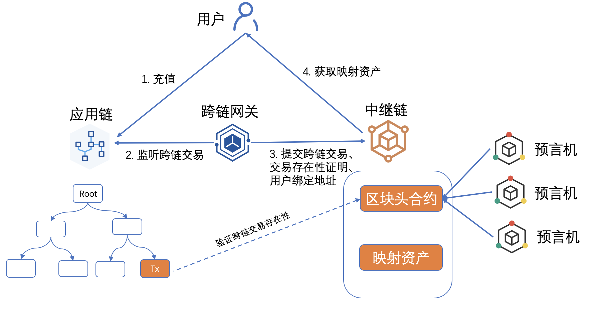
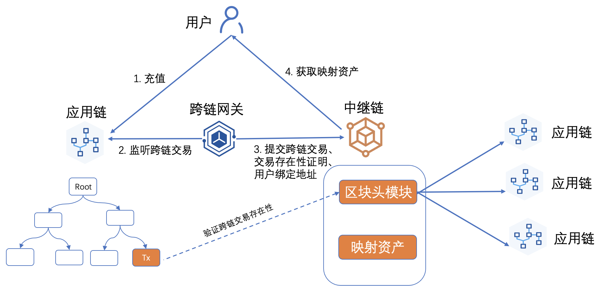
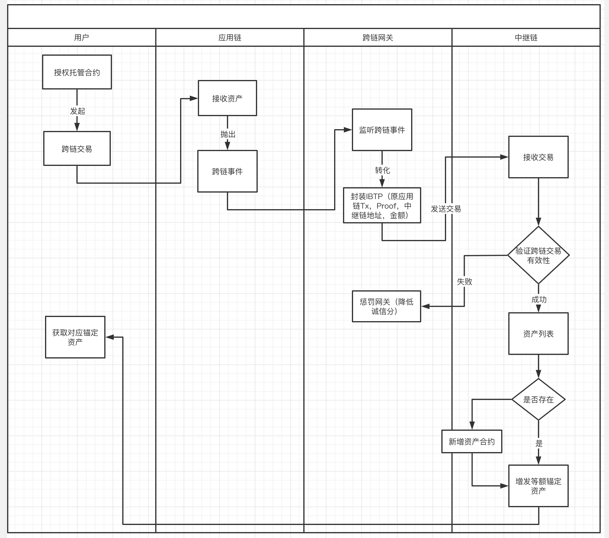
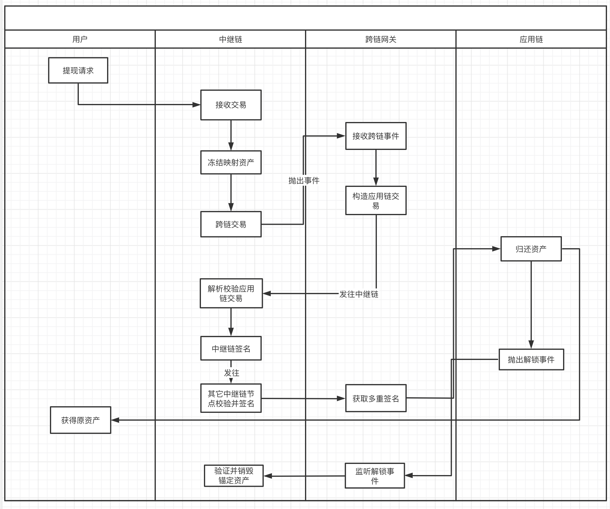

# ERC20资产跨链
#  1. 概述

解决ERC20资产跨链问题，支持任意ERC20资产的跨链交易。

# 2.详细设计

ERC20资产跨链方案采用中继节点多签的资产交换方案，中继链每个节点是应用链托管合约的成员，节点需同步对应应用链的区块头信息，通过这种方式验证跨链交易的有效性，关于验证的过程可以放在验证规则内，同时在用户充值和提现的流程中保证跨链交易的原子性，达到跨链资产与锚定资产的一致性。这里以三个方面来解决ERC20的跨链问题：

1. 如何同步可靠的应用链区块头；

2. 如何设计托管合约，同时兼顾其安全性；

3. 如何设计用户的充值、提现流程，尽量简化用户操作；

## 2.1 同步区块头

同步区块头有两种方案，一种是Oracle预言机的方式，一种是系统内置集成同步区块头模块。

方案一：

通过Oracle可信预言机(跨链网关)，向中继链区块头合约注入应用链的区块头，区块头合约包含验证跨链交易和增加区块的功能。该方案的优点是可以灵活适配各个应用链，缺点是依赖外部的可信数据源。




区块头合约的主要接口如下：

```go
func AppendAppchainBlockHeader(appchainId, blockHeader)

func VerifyInterchainTxProof(originTx, proof, blockHeight)
```


方案二：

跨链平台内置集成同步区块头模块，该方案的优点是去中心化，缺点是耦合性强，每接入新的应用链需要加入新的同步区块头模块；同步区块头是中继链节点主动获取，还需要考虑网络问题。



区块头模块的主要接口如下：

```go
func FetchAppchainBlockHeader(blockHeader)

func VerifyInterchainTxProof(originTx, proof, blockHeight)
```


## 2.2 托管合约

ERC20包含如下接口：

```javascript
interface IERC20 {
    function totalSupply() external view returns (uint256);
    
	function balanceOf(address account) external view returns (uint256);
    
	function transfer(address recipient, uint256 amount) external returns (bool);
    
	function allowance(address owner, address spender) external view returns (uint256);
    
	function approve(address spender, uint256 amount) external returns (bool);

    function transferFrom(address sender, address recipient, uint256 amount) external returns (bool);

    event Transfer(address indexed from, address indexed to, uint256 value);

    event Approval(address indexed owner, address indexed spender, uint256 value);
}

```

在跨链充值过程中我们需要用到ERC20合约中的**approve**授权方法和**transferFrom**转账方法，

同时还需要提供**name**和**decimal**的元信息。

```javascript
function approve(address spender, uint256 amount) external returns (bool);

function transferFrom(address sender, address recipient, uint256 amount) external returns (bool);

```

在跨链提现过程中我们需要用到ERC20合约中的**transfer**转账方法。

```javascript
function transfer(address recipient, uint256 amount) external returns (bool);
```


托管合约主要接口如下：

```javascript
event lock(address erc20Token, uint256 amount, string relay_addr)

event unlock(address unlock, uint256 amount, string ralay_tx_hash,)

// 添加中继链多签节点地址
func addRelayAdmin(address relay_admin) onlyAdmin external returns (bool)

// 移除中继链多签节点地址
func removeRelayAdmin(address relay_admin) onlyAdmin external returns (bool)

// 用户授权托管合约可以使用ERC20的代币
function approve(address erc20Token, address spender, uint256 amount) external returns (bool)
 
// 用户发起跨链交易,将ERC20代币锁仓进托管合约
function lock(address erc20Token, uint256 amount, string relay_addr) external returns (bool);

// 中继链解锁跨链资产，将ERC20代币归还用户
// 该接口需要接收quorum个中继链节点的签名后才可归还资产
function unlock(address erc20Token, uint256 amount, address unlocker, string ralay_tx_hash, r [][]byte, s [][]byte, v[][]byte) external returns (bool);
```


## 2.3 充值、提现流程设计

**用户充值流程：**

1. 用户调用托管合约，授权托管合约允许使用指定ERC20的资产；

2. 用户调用托管合约发起跨链交易；

3. 托管合约接收到ERC20资产，抛出跨链事件（ERC20_Contract、ERC20_Name、ERC20_Decimal、ERC20_Amount、Relay_Addr）;

4. 跨链网关监听到跨链事件，封装IBTP（原应用链Tx、跨链交易证明、中继链地址、跨链金额等等）；

5. 跨链网关发送跨链交易给中继链；

6. 中继链接收到跨链交易后，验证跨链交易的有效性；

7. 验证失败后会在跨链网关诚信合约惩罚对应的跨链网关（待定）；

8. 验证成功后检查资产列表，如果是新增资产则新建对应的ERC20资产托管合约；

9. 通过跨链交易的（Amount、Addr）增发等额的锚定资产，用户完成跨链充值操作；




**用户提现流程：**

1. 用户在中继链上发起提现请求（目的链地址，ERC20地址，金额，用户应用链地址）；

2. 中继链接收到交易，冻结用户在中继链等额的锚定资产；

3. 中继链发起跨链交易，抛出跨链事件（目的链地址，ERC20地址，金额，用户应用链地址）；

4. 跨链网关监听到跨链事件，构造对应应用链的交易；

5. 跨链网关将应用链的交易发往中继链；

6. 中继链解析并校验应用链的交易，包括地址，金额等等；

7. 中继链验证通过后签名，发完其它中继链要求其签名；

8. 跨链网关获取到中继链节点的多重签名数据，调用应用链的托管合约；

9. 应用链归还资产，抛出解锁事件；

10. 跨链网关监听到解锁事件，发往中继链；

11. 中继链验证通过后销毁对应的锚定资产；

