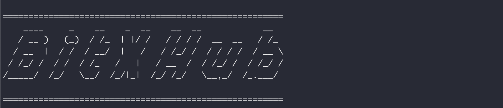

# 中继跨链 部署文档

中继链用于应用链的跨链管理，以及跨链交易的可信验证与可靠路由，是一种实现IBTP协议的开放许可链。目前BitXHub已经支持中继链之间相互连接，达到跨链交易在中继链之间进行同步，极大地提升了BitXHub的可扩展性。

### 部署前准备

安装包获取可参照单独部署中继链的文档进行下载和操作，注意中继跨链至少需要部署两套中继链节点环境，其中中继链之间通过特殊配置的pier（我们称之为Upier）相连，由此可知部署中继跨链系统的关键是在于配置好Upier

### 修改BitXHub配置文件并启动两套节点

这部分内容也可参照单独部署中继链的文档进行部署，待节点集群均打印出bitxhub的LOGO，表示bitxhub集群开始正常工作




## UPier配置和部署										

### 部署前准备

安装包获取可参照单独部署跨链网关的文档进行下载和操作，注意每套中继链节点均对应一个UPier，所以也至少需要配置和部署两个Upier节点。

### 修改配置文件

UPier和常规部署的pier配置大体一致，只是其启动的模式应选择为union，具体配置项如下：

```shell
#打开pier.toml进行配置修改
[mode]
type = "union" # relay, direct or union
...
...
[mode.union]
connectors = [
    "/ip4/127.0.0.1/tcp/44502/p2p/QmSqkijKLziphdTHpjqx6nRwhogqjhrMv2uGdbga7SqmdN",
    "/ip4/127.0.0.1/tcp/44501/p2p/QmXdcTWNXBCDyhmoQ2wuf8cwomjccWr2jZpD9jGZcwj8YY"
]
```

**注意：上面connectors字段需要配置两方的UPier的地址，其中后面那一段是根据pier私钥生成的id，可以使用pier p2p id 命令来获取，这也是union模式区别于中继模式的关键配置。**

导入应用链的二进制插件及相关的配置均可参照基础的配置文档进行操作

**说明：因为跨链合约和验证规则的部署涉及到不同应用链的细节，且需依赖应用链的安装部署，具体操作请见快速开始手册或使用文档，这里不再赘述**

### 互相注册中继链并启动

编写互相注册中继链的脚本，然后启动Upier（下面以Upier1为例）

```
##互相注册中继链:
##1 通过UPier1向Relay1注册Relay1:
pier --repo=UPier1 appchain register --name Relay1 --type relaychain  --desc Relay1 --version 1 --validators UPier1/genesis.json --addr localhost:60011
##回显： appchain register successfully, id is 0x454e2569dD093D09E5E8B4aB764692780D795C9a
##2 通过UPier1向Relay2注册Relay1:
pier --repo=UPier1 appchain register --name Relay1 --type relaychain  --desc Relay1 --version 1 --validators UPier1/genesis.json --addr localhost:50011
##回显： appchain register successfully, id is 0x454e2569dD093D09E5E8B4aB764692780D795C9a

##3 启动UPier:
## 清除下Pier下的store目录
rm -rf UPier1/store
## 启动UPier1
pier --repo=UPier1 start
```

**说明：1. 以上两个注册的步骤，--addr后面的参数分别是两套中继链节点的地址，需要根据实际情况进行更改；2. 另一个Upier2的脚本跟上面的内容基本一致，相互注册的bitxhub地址调换即可，这里不再赘述**

运行`pier --repo=UPier start`分别启动两个UPier，其日志显示两个UPier连接成功，两方的bitxhub节点日志上均显示 “appchain register successfully”即正常启动。


